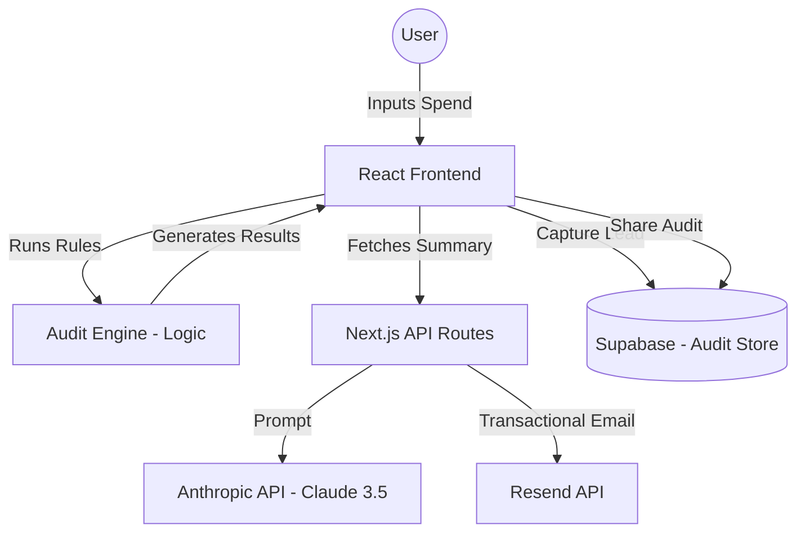

# Architecture

## System Diagram

## Data Flow
1. **Input**: User provides tool plans, seats, and spend.
2. **Logic**: `runAudit()` evaluates inputs against a set of defensible financial rules (defined in `audit-engine.ts`).
3. **Persistance**: Initial form state is synced to `localStorage`.
4. **Summary**: Frontend calls `/api/summary` with audit data. Claude 3.5 Sonnet generates a professional ~100-word summary.
5. **Storage**: When a user submits a lead or clicks "Share," a snapshot of the audit (stripped of PII) is stored in Supabase with a unique 10-char ID.

## Tech Stack Choice
- **Next.js**: Single framework for both UI and serverless backend.
- **TypeScript**: Ensuring type safety across the audit logic.
- **Vanilla CSS**: Premium, bespoke design system.
- **Supabase**: Rapid backend deployment.

## Scaling to 10k Audits/Day
If this tool had to handle 10k audits/day:
1. **Caching**: I would cache common audit result summaries to reduce Anthropic API costs.
2. **Rate Limiting**: Implement Upstash/Redis rate limiting on the API routes to prevent abuse.
3. **Queueing**: Use a message queue (like BullMQ or Upstash QStash) for email delivery to handle bursts.
4. **Static Generation**: Pre-generate the "Share" pages using Incremental Static Regeneration (ISR) to reduce database load.
